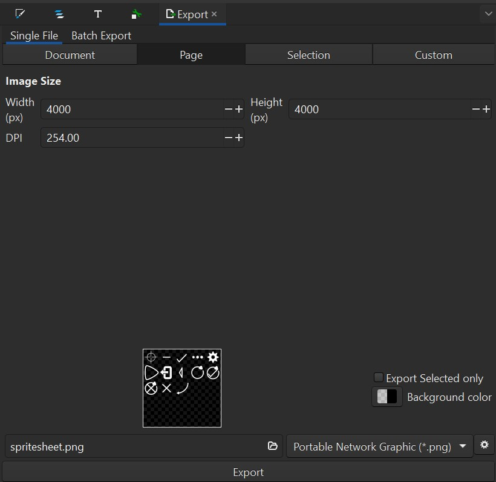

# On rebuilding spritesheet.png

1. Download Inkscape
2. Open `spritesheet.svg` as a project in Inkscape
3. Export the file as a png with a transparent background and 4000x4000 resoloution
4. Unity should be able to decode the sprites from the metadata file

